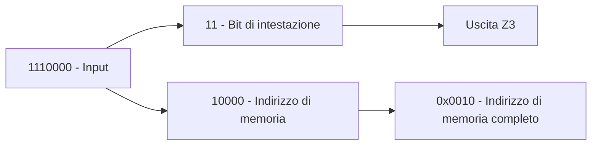
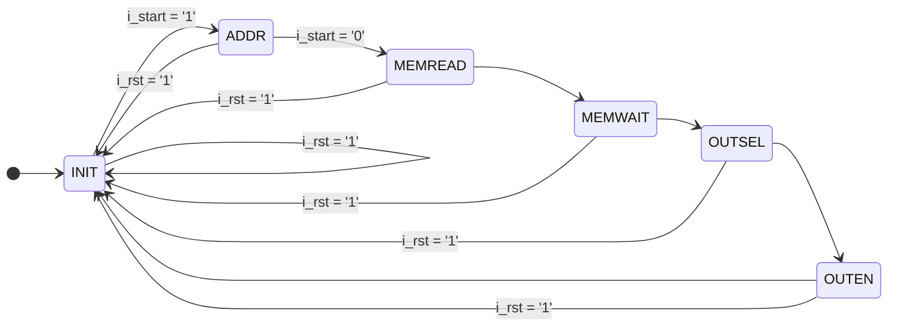

# Relazione sul progetto di Reti Logiche

Anno accademico 2022/2023

Professor Fabio Salice

Riccardo Manfredonia e Mario Merlo

---

## Introduzione

### Obiettivo

Implementare un modulo hardware, descritto in VHDL, che si interfacci con una memoria.

In particolare, il sistema riceve indicazioni circa una locazione di memoria il cui contenuto deve essere indirizzato verso un canale di uscita fra i quattro disponibili.

Le indicazioni circa il canale da utilizzare e l'indirizzo di memoria a cui accedere vengono forniti mediante un ingresso seriale, mentre le uscite del sistema, ovvero i canali, forniscono tutti i bit della parola di memoria in parallelo.

### Specifiche e Funzionamento

Il modulo da implementare ha:

- Due ingressi primari da un bit: 
	- `i_w`
	- `i_start`
- Quattro uscite primarie da otto bit:
	- `o_z0`
	- `o_z1`
	- `o_z2`
	- `o_z3`
- Un segnale di fine a un bit:
	- `o_done`
- Due segnali che controllano l'andamento del modulo:
	- `i_clk`
	- `i_rst`

I dati ottenuti in ingresso da `i_w` sono letti dalla macchina ad ogni fronte di salita di `i_clk`.

In particolare, i dati in ingresso sono organizzati come di seguito:

- Due bit di intestazione
- $n$ bit di indirizzo di memoria, dove $0 \le n \le 16$

I due bit di intestazione codificano l'uscita a cui inviare il dato della memoria nel seguente modo:

| Intestazione | Canale d'uscita |
| ------------ | --------------- |
| `00`         | `o_z0`          |
| `01`         | `o_z1`          |
| `10`         | `o_z2`          |
| `11`         | `o_z3`          | 

Non è necessario specificare tutti e sedici i bit di indirizzo. Nel caso $n < 16$, l'indirizzo viene completato con degli zeri a sinistra, come negli esempi che seguono:

| Indirizzo in ingresso | Indirizzo passato a memoria |
| --------------------- | --------------------------- |
| Vuoto                 | `0x0000`                    |
| `1111`                | `0x000f`                    |
| `1110011`             | `0x0073`                    |
| `1111111111111111`    | `0xffff`                    | 

La sequenza di ingresso `i_w` è valida solo quando `i_start = '1'` e termina quando `i_start = '0'`. In particolare, il segnale `i_start` rimane alto per almeno due cicli di clock e per non più di diciotto[^1].

Una volta ricevuti tutti i bit di ingresso, il sistema deve accedere alla memoria e leggere il contenuto della locazione di memoria indicata dagli $n$ bit di indirizzo.

Le uscite `0_z0`, `0_z1`, `0_z2`, `0_z3` sono inizialmente a `0x00` e rimangono tali finché non vengono alterate dal messaggio letto in memoria.

Una volta recuperato il dato richiesto dalla locazione di memoria indicata dagli $n$ bit di indirizzo, il segnale `o_done` viene posto a `1` per un solo ciclo di clock e l'uscita selezionata dai bit di intestazione viene aggiornata con i bit letti dalla memoria. Le altre uscite mantengono il valore che avevano al precedente aggiornamento[^2].

Quando il segnale `o_done` ritorna basso, il sistema attende che `i_start` torni alto prima di ricominciare il ciclo.

Il tempo massimo che il componente deve impiegare per portare all'uscita corretta il dato recuperato dalla memoria, a partire da quando `i_start = '0'`, è di venti cicli di clock.

Quando il modulo riceve un segnale di reset, ossia `i_rst = '1'`, tutte le uscite devono essere riportate al valore `0x00`.

### Esempio di funzionamento

Si ipotizzi che nel modulo di memoria, all'indirizzo `0x0010`, risieda il dato `0xaa`.

Si ipotizzi poi che, dopo il passaggio di `i_start` al valore `1`, dall'ingresso `i_w` passi una sequenza di bit pari a `1110000`.

Analizziamo l'input:



Quindi, affinché la macchina funzioni correttamente, quando `o_done = '1'`, le quattro uscite della macchina dovranno essere nel seguente stato (ipotizzando che sia la prima esecuzione dopo il reset):

| Uscita | Dato   |
| ------ | ------ |
| `o_z0` | `0x00` |
| `o_z1` | `0x00` |
| `o_z2` | `0x00` |
| `o_z3` | `0xaa` |

### Interfaccia del componente

Il componente da descrivere ha queste caratteristiche:

```vhdl
entity project_reti_logiche is
port (
	i_clk      : in std_logic;
	i_rst      : in std_logic;
	i_start    : in std_logic;
	i_w        : in std_logic;
	o_z0       : out std_logic_vector(7 downto 0);
	o_z1       : out std_logic_vector(7 downto 0);
	o_z2       : out std_logic_vector(7 downto 0);
	o_z3       : out std_logic_vector(7 downto 0);
	o_done     : out std_logic;
	o_mem_addr : out std_logic_vector(15 downto 0);
	i_mem_data : in std_logic_vector(7 downto 0);
	o_mem_we   : out std_logic;
	o_mem_en   : out std_logic
);
end project_reti_logiche;
```

Di seguito, sono spiegati i segnali del componente:

| Segnale      | Descrizione                                                                                                                           |
| ------------ | ------------------------------------------------------------------------------------------------------------------------------------- |
| `i_clk`      | Segnale di clock del componente. Sarà generato dai test bench durante le simulazioni.                                                 |
| `i_rst`      | Segnale di reset. Inizializza la macchina, ponendo a valori di default uscite e segnali interni.                                      |
| `i_start`    | Segnale che indica l'inizio e la fine di una sequenza di ingresso.                                                                    |
| `i_w`        | Segnale seriale di ingresso da cui vengono letti gli indirizzi di memoria.                                                            |
| `o_zX`       | Canali di uscita da otto bit del componente.                                                                                          |
| `o_done`     | Segnale in uscita che indica la fine dell'elaborazione.                                                                               |
| `o_mem_addr` | Segnale parallelo a sedici bit usato per inviare l'indirizzo di memoria al modulo della memoria stessa.                               |
| `i_mem_data` | Segnale parallelo a otto bit da cui il componente legge il dato all'indirizzo di memoria specificato in `o_mem_addr`.                 |
| `o_mem_we`   | Segnale di abilitazione alla scrittura in memoria[^3].                                                                                |
| `o_mem_en`   | Segnale di abilitazione alla lettura dalla memoria. Va impostato a uno quando si vuole recuperare un dato ad un indirizzo di memoria. | 

---

## Architettura

Per questo progetto, abbiamo deciso di basarci sull'FPGA Artix-7 FPGA xc7a200tfbg484-1.

Per sviluppare questo componente, abbiamo implementato diversi moduli funzionali:

| Modulo                  | Descrizione                                                                                                                             |
| ----------------------- | --------------------------------------------------------------------------------------------------------------------------------------- |
| Modulo di controllo     | Costituito da una macchina a stati finiti che controlla il ciclo di elaborazione della macchina.                                        | 
| Modulo di lettura input | Costituito da due registri a scorrimento ed un contatore. Si occupa di leggere e salvare i dati in ingresso.                            |
| Modulo di output        | Costituito da quattro registri che conservano i valori da mostrare in uscita per il ciclo di elaborazione corrente e quelli successivi. |

Per implementare i moduli elencati sopra, usufruiamo dei seguenti segnali interni:

```vhdl
-- FSM States
type S is (INIT, ADDR, MEMREAD, MEMWAIT, OUTSEL, OUTEN);
signal cur_state, next_state : S;

-- Memory address management
signal addr_shift_register   : std_logic_vector(15 downto 0);
signal header_shift_register : std_logic_vector(1 downto 0);

-- Output management
signal data0, data1, data2, data3 : std_logic_vector(7 downto 0);

-- Counter management
signal counter    : integer range 0 to 2;
signal counter_en : std_logic;
```

A seguire, una breve descrizione di ciascuno:

| Segnale                 | Descrizione                                                                                                                                                                                                                       |
| ----------------------- | --------------------------------------------------------------------------------------------------------------------------------------------------------------------------------------------------------------------------------- |
| `cur_state`             | Lo stato corrente della macchina a stati finiti che controlla il componente.                                                                                                                                                      |
| `next_state`            | Lo stato prossimo della macchina a stati finiti.                                                                                                                                                                                  |
| `addr_shift_register`   | Un registro a scorrimento da sedici bit che si occupa di salvare l'indirizzo di memoria preso dall'input `i_w` e di aggiungervi gli zeri in testa necessari a renderlo di esattamente sedici bit.                                 |
| `header_shift_register` | Un registro a scorrimento da due bit che si occupa di salvare i due bit di intestazione che codificano il canale d'uscita.                                                                                                        |
| `dataX`                 | Quattro registri da otto bit ciascuno che conservano il dato che va portato in uscita per le quattro uscite `o_zX`. Questi registri sono necessari per mostrare in uscita i valori precedenti delle uscite quando `o_done = '1'`. |
| `counter`               | Un contatore che conta il numero di bit che entrano da `i_w`. Quando raggiunge il valore `2`, i due bit di intestazione sono stati letti e il registro `addr_shift_register` può iniziare a leggere da `i_w`.                     |
| `counter_en`            | Un segnale di abilitazione che impedisce al contatore di incrementarsi nel caso in cui ci sia un reset o abbia già raggiunto il massimo in un ciclo di elaborazione.                                           | 

Mostriamo ora la schematica del componente elaborata da Vivado prima della sintesi:


Descriviamo ora nel dettaglio il funzionamento di ciascun modulo.

### Modulo di controllo

Il componente viene controllato tramite una macchina a stati finiti che stabilisce in quale fase dell'elaborazione si trovi il componente:



A seguito, una breve descrizione degli stati che compongono la macchina:

| Stato     | Descrizione                                   | Comportamento                                                                                                                                                                                                                                                         |
| --------- | --------------------------------------------- | --------------------------------------------------------------------------------------------------------------------------------------------------------------------------------------------------------------------------------------------------------------------- |
| `INIT`    | Stato iniziale della macchina.                | Quando `i_rst` diventa alto, la macchina ritorna in questo stato e tutti i segnali vengono riportati a zero. Quando `i_start` diventa alto, la macchina passa allo stato `ADDR`                                                                                       |
| `ADDR`    | Stato di lettura dell'input `i_w`.            | Vengono attivati i registri a scorrimento che si occupano di salvare i bit di intestazione e di indirizzo. Quando `i_start` torna basso, la macchina passa allo stato `MEMREAD`.                                                                                      |
| `MEMREAD` | Stato di invio dati alla memoria.             | Viene inviato l'indirizzo letto in `ADDR` al modulo di memoria, insieme al segnale di attivazione `o_mem_en`. La macchina passa automaticamente allo stato `MEMWAIT` al prossimo fronte di salita del clock.                                                          |
| `MEMWAIT` | Stato di attesa ricezione dati dalla memoria. | Il componente aspetta che la memoria, che è asincrona, invii in uscita il dato richiesto allo stato precedente, per poi essere salvato nel registro di uscita corretto. La macchina passa automaticamente allo stato `OUTSEL` al prossimo fronte di salita del clock. | 
| `OUTSEL`  | Stato di selezione dell'uscita.               | La macchina valuta i bit di intestazione ricevuti in `ADDR` per selezionare in che registro dati (`dataX`) salvare il dato ricevuto dalla memoria allo stato precedente. La macchina passa automaticamente allo stato `OUTEN` al prossimo fronte di salita del clock. |
| `OUTEN`   | Stato di abilitazione delle uscite.           | Tutti i registri dei dati vengono "copiati" sulle uscite `zX` e il segnale di fine `o_done` viene posto a uno. La macchina passa automaticamente allo stato `INIT` al prossimo fronte di salita del clock.                                                            |

Il modulo di controllo è stato implementato in VHDL tramite tre processi:

- Un processo gestisce il reset della macchina a stati finiti e il passaggio da uno stato al successivo, riassegnando i due segnali `cur_state` e `next_state`
- Un processo sintetizza la funzione stato corrente della macchina a stati finiti, assegnando i valori di alcuni segnali a seconda del valore di `cur_state`
- Un processo sintetizza la funzione stato prossimo della macchina a stati finiti, assegnando il segnale `next_state` a seconda del valore di `i_start`, `i_rst` e `cur_state`
- Un processo che gestisce il comportamento del contatore (`counter`), assegnando il segnale `counter_en`  a seconda del valore di `i_start`, `i_rst`.

#### Processo di gestione stato e reset

Questo processo viene attivato dai segnali `i_clk` e `i_rst`.

Quando `i_rst = '1'`, questo processo pone `cur_state <= INIT`, in modo che il componente possa ricominciare un ciclo di elaborazione da capo.

Quando invece il clock va in fronte di salita, viene effettuato l'assegnamento `cur_state <= next_state`, facendo progredire la macchina al prossimo stato valido, deciso dal processo che sintetizza la funzione stato prossimo.

#### Processo funzione stato prossimo

Questo processo sintetizza la funzione stato prossimo della macchina a stati finiti, che decide in che stato si dovrà trovare la macchina a seconda dello stato corrente e del segnale `i_start`:

| `cur_state` | `i_start` | `next_state` |
| ----------- | --------- | ------------ |
| `INIT`      | `0`       | `INIT`       |
| `INIT`      | `1`       | `ADDR`       |
| `ADDR`      | `0`       | `MEMREAD`    |
| `ADDR`      | `1`       | `ADDR`       |
| `MEMREAD`   | `-`[^4]   | `MEMWAIT`    |
| `MEMWAIT`   | `-`       | `OUTSEL`     |
| `OUTSEL`    | `-`       | `OUTEN`      |
| `OUTEN`     | `-`       | `INIT`       |

Inoltre, quando `i_rst = '1'`, questo processo imposta `next_state <= INIT`, in modo che la macchina possa ricominciare il suo ciclo di elaborazione correttamente dopo un reset.

#### Processo funzione stato corrente

Questo processo sintetizza la funzione stato corrente della macchina a stati finiti, che cambia il valore di alcuni segnali a seconda dello stato in cui si trova:

| `cur_state`  | `o_z0`  | `o_z1`  | `o_z2`  | `o_z3`  | `o_done` | `o_mem_addr`          | `o_mem_en` |
| ------------ | ------- | ------- | ------- | ------- | -------- | --------------------- | ---------- |
| `MEMREAD`    | `0x00`  | `0x00`  | `0x00`  | `0x00`  | `0`      | `addr_shift_register` | `1`        |
| `OUTEN`      | `data0` | `data1` | `data2` | `data3` | `1`      | `0x0000`              | `0`        |
| `others`[^5] | `0x00`  | `0x00`  | `0x00`  | `0x00`  | `0`      | `0x0000`              | `0`        |

### Modulo di lettura input

Il modulo di lettura è stato implementato in VHDL tramite due processi:

- Processo di gestione `header_shift_register`
- Processo di gestione `addr_shift_register`
- Processo di gestione del contatore

#### Processo di gestione `header_shift_register`

Questo processo gestisce il salvataggio dei primi due bit letti da `i_w` per identificare il corretto canale d'uscita.

Quando il segnale di reset è alto,  `header_shift_register` e `counter` vengono azzerati, ai valori `0x00` e `0` rispettivamente.

Se il segnale di reset è basso, invece, ad ogni fronte di salita del clock vengono fatti dei controlli su altri segnali del componente:

- Se `i_start` è alto:
	- Se `counter` non ha ancora raggiunto il valore 2 e `counter_en = '1'`, nel registro `header_shift_register` viene caricato il valore di `i_w` e il contatore viene incrementato di 1;
	- Altrimenti, `header_shift_register` viene mantenuto al valore corrente.
- Se `i_start` è basso:
	- Se lo stato corrente della macchina a stati è `INIT`, `header_shift_register` e `counter` vengono azzerati allo stesso modo di quando `i_rst = '1'`;
	- Altrimenti, `header_shift_register` viene mantenuto al valore corrente.

#### Processo di gestione `addr_shift_register`

Questo processo gestisce il salvataggio dell'indirizzo di memoria.

Quando `i_rst = '1'`, il registro `addr_shift_register` viene resettato, ponendo il suo valore a `0x0000`.

Ad ogni fronte di salita del clock, invece:

- Se `i_start = '1'` e sono già stati letti due bit da `i_w`, condizione controllata dal valore di `counter`, allora il registro comincia a salvare i bit in arrivo dall'input;
- Se `i_start = '0'`, il registro a scorrimento mantiene il suo valore precedente;
- Se lo stato corrente della macchina a stati è `INIT`, `addr_shift_register` viene posto a `0x0000`, come nel caso di un reset.

In questo modo, quando `i_start` torna basso, `addr_shift_register` conterrà l'indirizzo di memoria da cui recuperare il dato con $16-n$ bit a zero a sinistra.

#### Processo di gestione del contatore

Per evitare che il contatore venga incrementato in fasi dell'elaborazione in cui non serve, abbiamo implementato un segnale di abilitazione `counter_en` che viene controllato da un processo sensibile ai segnali `i_start` e `i_rst`.

Il processo imposta `counter_en` secondo la seguente logica:

| `i_start` | `i_rst` | `counter_en` |
| --------- | ------- | ------------ |
| `0`       | `0`     | `0`          |
| `1`       | `0`     | `1`          |
| `-`       | `1`     | `0`          |

### Modulo di output

Il modulo di output è stato implementato in VHDL tramite un processo che gestisce i registri delle uscite `dataX`.

Dato che il componente deve "ricordarsi" dei valori precedenti delle uscite tra un'elaborazione e l'altra, abbiamo deciso di implementare quattro registri in cui salvare i dati provenienti dalla memoria.

All'abilitazione delle uscite, non facciamo altro che copiare i dati da questi registri alle uscite per un ciclo di clock, prima di riportare a `0x00` le uscite `o_zX`.

Il dato preso dalla memoria `i_mem_data` viene salvato in `dataX` a seconda del valore del segnale `header_shift_register`:

| `header_shift_register` | `i_mem_data` |
| ----------------------- | ------------ |
| `00`                    | `data0`      |
| `01`                    | `data1`      |
| `10`                    | `data2`      |
| `11`                    | `data3`      |

Visto che, dopo un reset, il componente deve ricominciare il ciclo di elaborazione come se prima non ne avesse compiuti altri, le uscite `dataX` vengono impostate a `0x00` quando `i_rst` è alto.

---

## Risultati sperimentali

### Introduzione alle simulazioni

Per confermare che il funzionamento della macchina corrispondesse a quello richiesto dalla specifica, abbiamo utilizzato la funzione di Vivado che permette di simulare il componente sollecitandone gli input.

Abbiamo eseguito quindici batterie di test sia in modalità comportamentale (o pre-sintesi), sia in modalità post-sintesi.

Le batterie di test che abbiamo eseguito possono essere categorizzate in tre gruppi:

- Test bench forniti dal docente
- Test bench creati da noi per testare casi limite
- Test bench generati casualmente

Qui sotto riportiamo i risultati più degni di nota.

### Test bench forniti dal docente

Tutti i test bench forniti dal docente come esempio sono stati passati dal componente sia in modalità comportamentale, sia in modalità post sintesi.

Questi test bench sono stati fondamentali per comprendere più a fondo il linguaggio VHDL e lo sviluppo dei vari moduli del nostro componente.

### Test dei casi limite

Per assicurarci che il componente sviluppato funzioni in qualsiasi scenario, abbiamo sviluppato un test bench che simuli casi di funzionamento limite. Qui sotto è riportata la waveform degli input e degli output dell'intera simulazione:


Per confermare il funzionamento reale del componente, riportiamo anche il risultato della simulazione post-sintesi dello stesso test bench:


Procediamo ora a indicare alcuni dettagli di queste simulazioni[^6].

#### Indirizzo di lunghezza zero

Secondo la specifica, quando il componente incontra un input che contiene soltanto i due bit di intestazione, l'indirizzo di memoria viene posto di default a `0x0000`.

Ecco il comportamento del nostro componente in un caso del genere:


Come si può notare, il registro a scorrimento `addr_shift_register` rimane a `0x0000` per tutta la durata della fase di lettura, come specificato nella sezione [*Architettura*](#architettura).

#### Indirizzo di lunghezza massima

Questo è il caso duale al precedente, in cui l'indirizzo in input da `i_w` è di diciotto bit in totale.


Come si nota, il componente funziona senza problemi.

#### Reset durante la lettura dell'indirizzo

Con questo test, abbiamo voluto mostrare il comportamento del componente di fronte ad un reset durante la lettura dell'indirizzo.


Come si può notare, il componente ritorna allo stato `INIT` ed è pronto ad un nuovo ciclo di elaborazione.

#### Reset durante l'elaborazione dell'indirizzo

Con questo test abbiamo voluto dimostrare il comportamento del componente di fronte ad un reset durante il salvataggio dell'indirizzo.


Come si può notare, il componente ritorna allo stato `INIT` ed è pronto ad un nuovo ciclo di elaborazione.
 
#### Reset al segnale di fine elaborazione

Con questo test abbiamo voluto dimostrare il comportamento del componente di fronte ad un reset nel ciclo di clock in cui `o_done` viene posto a 1.


Come si può notare, il segnale `o_done` rimane alzato per solo mezzo ciclo di clock poiché il reset prende priorità sul funzionamento del componente, riportando immediatamente il modulo in uno stato in cui possa ricominciare l'elaborazione.

### Test generati casualmente

In questo ultimo test da noi affrontato, abbiamo voluto trovare una conferma della solidità del nostro componente producendo mille cicli di elaborazione casuali consecutivi:


Mostriamo anche un dettaglio della stessa simulazione:


Per eccesso di zelo, abbiamo deciso di fare anche un test casuale da diecimila cicli di elaborazione:


È interessante notare, oltre al funzionamento del componente, anche il tempo totale di elaborazione di grandi quantità di dati. Infatti, il tempo della simulazione nel caso del test da mille eventi è stato di $0.004\ s$, mentre il tempo della simulazione nel caso del test da diecimila eventi è stato di $0.04\ s$.

Concludiamo dicendo che questi due test sono stati passati anche in simulazione post-sintesi:

> [!success] Simulazione da mille eventi (post-sintesi)
> 

> [!success] Simulazione da diecimila eventi (post-sintesi)
> 

### Risultati della sintesi

Il componente è sintetizzabile senza errori e non abbiamo riscontrato nessun latch inferito nel design sintetizzato.

Riportiamo ora la schematica del componente dopo la sintesi:


Mostriamo anche i report di utilizzo della FPGA e del timing:

> [!info] Report di utilizzo
> 
> | Site Type             | Used | Fixed | Prohibited | Available | Util% |
| --------------------- | ---- | ----- | ---------- | --------- | ----- |
| Slice LUTs*           | 45   | 0     | 0          | 134600    | 0.03  |
| LUT as Logic          | 45   | 0     | 0          | 134600    | 0.03  |
| LUT as Memory         | 0    | 0     | 0          | 46200     | 0.00  |
| Slice Registers       | 55   | 0     | 0          | 269200    | 0.02  |
| Register as Flip Flop | 55   | 0     | 0          | 269200    | 0.02  |
| Register as Latch     | 0    | 0     | 0          | 269200    | 0.00  |
| F7 Muxes              | 0    | 0     | 0          | 67300     | 0.00  |
| F8 Muxes              | 0    | 0     | 0          | 33650     | 0.00  |

> [!info] Report di timing
> ```
> Timing Report
>     
> Slack (MET) :             97.289ns  (required time - arrival time)
> ```
> 
> 

---

## Conclusioni

Il processo di design del componente è stato inizialmente arduo, data la natura fondamentalmente diversa del VHDL da quella di un qualsiasi linguaggio di programmazione. Capire che il VHDL descrive un componente e non lo programma è stato fondamentale per arrivare ad un design iniziale funzionante.

Dopo aver passato i primi test in simulazione comportamentale, la sintesi è stata la parte più complessa. L'architettura iniziale da cui eravamo partiti non era adatta al funzionamento reale dell'FPGA utilizzata, perciò le simulazioni post-sintesi non davano risultati positivi.

Una volta ripensata l'architettura, giungendo ad una soluzione simile a quella che presentiamo ora, siamo riusciti a passare diversi test bench, ma con un alto numero di latch inferiti.

Dopo aver pulito il codice, facendo così sparire i latch, abbiamo provato alcuni casi limite, corretto il componente per tenerne conto e siamo così giunti all'architettura finale, con zero latch e un design che non solo può essere sintetizzato correttamente, ma anche implementato.

[^1]: Non è considerato il caso in cui `i_start` sia alto per meno di due cicli di clock o per più di diciotto, come menzionato nella specifica.
[^2]: Se un'uscita non è mai stata selezionata, essa mantiene il valore di reset `0x00`.
[^3]: Non verrà usato in questo progetto, perciò rimarrà fisso a zero.
[^4]: Questo simbolo indica "don't care".
[^5]: Questo simbolo indica tutti gli stati non indicati esplicitamente nella tabella.
[^6]: Riportiamo soltanto le waveform delle simulazioni comportamentali per mostrare nel dettaglio tutti i segnali interni, che vanno persi dopo la rielaborazione post-sintesi del componente.
